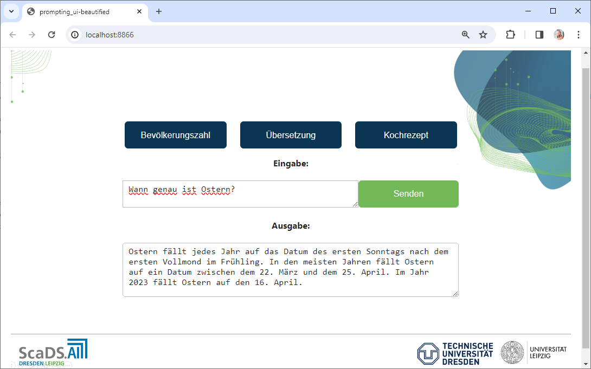

# prompting-with-api

This jupyter-based and voilá-ready prompting app gives the ability to use an api key for prompting workshops with an unlimited number of participants (while keeping in mind that some models cost per request). It bridges the temporary situation that there are no institutional LLM accesses yet and solutions such as GPTX are still a work in progress. 



## Installation using python virtual environments

* start terminal
* ```git clone "repo"``` to preferred directory
* ```cd``` to "repo"-folder
* ```create venv (windows: python -m venv prompting-venv)```
* ```activate venv (windows: prompting-venv/scripts/activate)```
* ```pip install -r requirements.txt```

## Installation into a conda environment

```
conda create --name prompting python=3.10
```

```
conda activate prompting
```

```
pip install -r requirements.txt
```

## Installation: OpenAI API Key

![CAUTION]
> You need an OpenAI API Key that is set correctly as an environment variable (do it manually!), [read more](https://platform.openai.com/docs/quickstart?context=python)


## Usage

In a terminal type for text2text:

```
voila prompting_ui-beautified.ipynb
```

or if you want to create images (text2img)

```
voila image-gen_ui-beautified.ipynb
```


